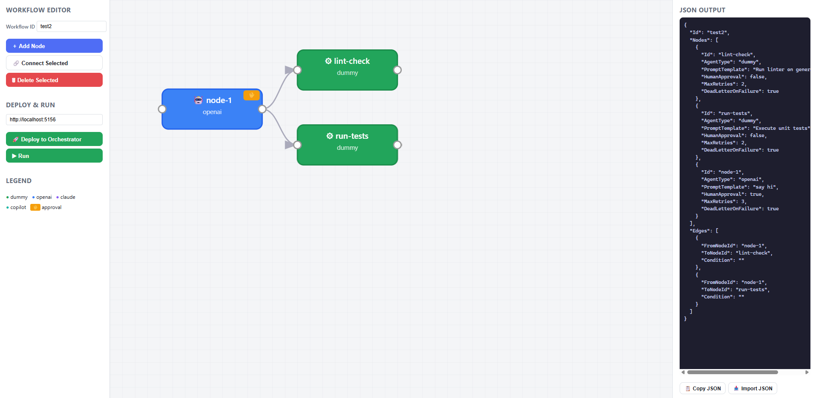
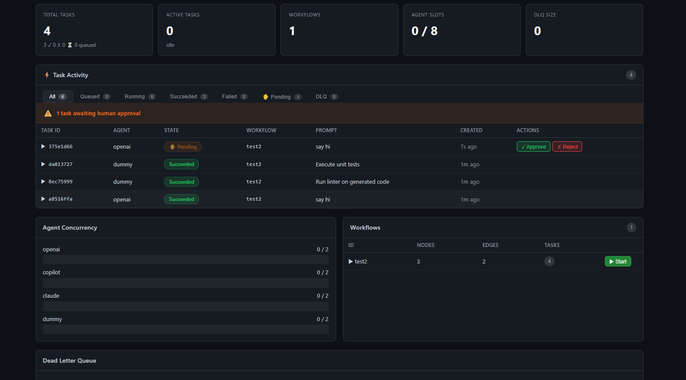

<div align="center">

# 🔥 Flint

### The orchestration runtime for AI agents

Queue tasks. Build DAG workflows. Approve, retry, observe — all from one API.

[](https://pypi.org/project/flint-ai/)
[](https://www.npmjs.com/package/@flintai/sdk)
[](LICENSE)
[](docker-compose.yml)

[Quickstart](#-quickstart) · [Dashboard](#-dashboard) · [SDKs](#-sdks) · [Webhook Agents](#-bring-any-agent) · [Docs](docs/QUICKSTART.md)

</div>

---

## 🎨 Visual Workflow Editor

Build agent DAGs visually — drag nodes, connect edges, set human approval gates, deploy in one click.



## 📊 Live Dashboard

Monitor every task in real time — approve pending tasks, inspect failures, restart from DLQ.



---

## ⚡ Quickstart

```bash
# Start Flint (no dependencies needed)
docker compose -f docker-compose.dev.yml up -d

# Submit a task
curl -X POST http://localhost:5156/tasks \
  -H "Content-Type: application/json" \
  -d '{"agentType": "dummy", "prompt": "Hello Flint!"}'

# Open the dashboard
open http://localhost:5156/dashboard/index.html
```

That's it. Flint is running with an in-memory queue. For production, use the full stack with Postgres + Redis:

```bash
docker compose up -d   # Postgres 15 + Redis 7 + Flint API + Worker
```

---

## ✨ Why Flint?

> **Think "Temporal for AI agents, but simpler."**

| Capability | What it does |
|---|---|
| 🔄 **Queue-driven execution** | Redis Streams or in-memory — pluggable backends |
| 🌊 **DAG workflows** | Fan-out, fan-in, conditional routing, approval gates |
| 🤖 **Any AI agent** | OpenAI, Claude, Copilot, LangChain, or your own via webhooks |
| 👤 **Human-in-the-loop** | Pause nodes for approval, approve/reject from dashboard or API |
| ♻️ **Resilient** | Auto-retry with backoff, dead-letter queues, restart from DLQ |
| 📊 **Observable** | Live dashboard, Prometheus metrics, OpenTelemetry tracing |
| 🐳 **One command** | `docker compose up` — Postgres, Redis, API, Worker, done |

---

## 🔌 Bring Any Agent

Flint doesn't replace your agent framework — it **orchestrates** it. Use the webhook agent to integrate any external service:

```
┌─────────────────┐     POST /execute     ┌────────────────────────┐
│   Flint          │ ───────────────────▶  │  Your Agent Service     │
│   (queue, retry,  │ ◀── JSON response ── │  (OpenAI SDK, Claude,   │
│   DAG, approval)  │                      │   LangChain, anything)  │
└─────────────────┘                       └────────────────────────┘
```

### Register an agent at runtime

```bash
# Point Flint at your agent service
curl -X POST http://localhost:5156/agents/register \
  -H "Content-Type: application/json" \
  -d '{"name": "researcher", "url": "http://localhost:8000/execute"}'

# Now use it in workflows — Flint handles queue, retry, DAG, approval
curl -X POST http://localhost:5156/tasks \
  -H "Content-Type: application/json" \
  -d '{"agentType": "researcher", "prompt": "Analyze market trends in AI"}'
```

### Works with OpenAI Agents SDK, Claude, and more

See ready-to-run examples:
- **[OpenAI Agents SDK](examples/python/openai_agents_example.py)** — Multi-agent with tools + handoffs
- **[Claude Coding Agent](examples/python/claude_agent_example.py)** — Tool use (read/write files, run commands)

---

## 📦 SDKs

<table>
<tr><td><b>Python</b></td><td><b>TypeScript</b></td><td><b>C#</b></td></tr>
<tr><td>

```bash
pip install flint-ai
```
```python
from flint_ai import OrchestratorClient
client = OrchestratorClient("http://localhost:5156")
task = client.submit_task("openai", "Summarize this PR")
```

</td><td>

```bash
npm i @flintai/sdk
```
```typescript
import { OrchestratorClient } from "@flintai/sdk";
const client = new OrchestratorClient("http://localhost:5156");
const task = await client.submitTask("openai", "Summarize this PR");
```

</td><td>

```bash
dotnet add package Flint.AI
```
```csharp
var client = new OrchestratorClient("http://localhost:5156");
var task = await client.SubmitTaskAsync("openai", "Summarize this PR");
```

</td></tr>
</table>

---

## 🏗️ Architecture

```
                          ┌──────────────────┐
                          │  Visual Editor    │
                          │  /editor/         │
                          └────────┬─────────┘
                                   ▼
Client / SDK ──▶ API (5156) ──▶ Queue (Redis) ──▶ Worker ──▶ Agent ──▶ Result
                     │                                         │
                     ├── Workflow Engine (DAG)                  ├── OpenAI
                     ├── Human Approval Gates                  ├── Claude
                     ├── Retry + DLQ                           ├── Webhook → Your Service
                     └── Dashboard /dashboard/                 └── Dummy (testing)
                                                    │
                                              ┌─────┴─────┐
                                              │ Postgres   │
                                              │ (durable)  │
                                              └───────────┘
```

---

## ⚙️ Environment Variables

| Variable | Description | Default |
|---|---|---|
| `ConnectionStrings__DefaultConnection` | Postgres connection string (omit for in-memory) | — |
| `USE_INMEMORY_QUEUE` | Use in-memory queue instead of Redis | `false` |
| `OPENAI_API_KEY` | OpenAI API key | — |
| `ANTHROPIC_API_KEY` | Claude API key | — |
| `WEBHOOK_AGENT_URL` | Default URL for webhook agents | — |
| `WEBHOOK_AGENT_URL_{NAME}` | Per-agent webhook URL (e.g. `WEBHOOK_AGENT_URL_RESEARCHER`) | — |
| `DUMMY_AGENT_DELAY` | Delay in ms for dummy agent (testing) | `100` |

---

## 🎯 Demo Workflows

| Demo | Pattern | Pipeline |
|------|---------|----------|
| [Code Review](examples/demos/code-review-pipeline/) | Sequential | generate → review → summarize |
| [Doc Summarizer](examples/demos/document-summarizer/) | Fan-out/in | split → parallel chunks → merge |
| [Research Team](examples/demos/research-agent-team/) | Complex DAG | planner → researchers → analyst → writer |

---

## 📚 Docs

| | |
|---|---|
| [Quickstart Guide](docs/QUICKSTART.md) | [API Reference (Swagger)](http://localhost:5156/swagger/) |
| [Environment Variables](docs/ENV_VARS.md) | [Contributing](CONTRIBUTING.md) |

---

<div align="center">

**[MIT License](LICENSE)** · Built with ❤️ for the AI agent community

</div>
